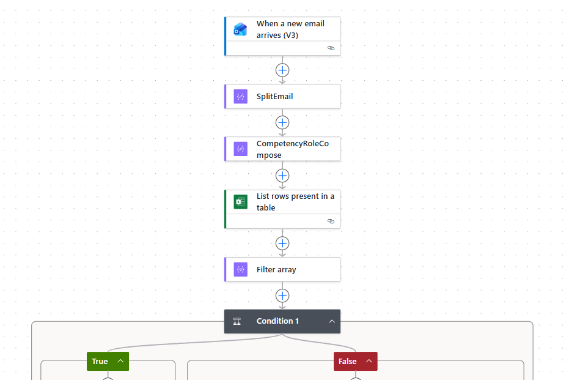
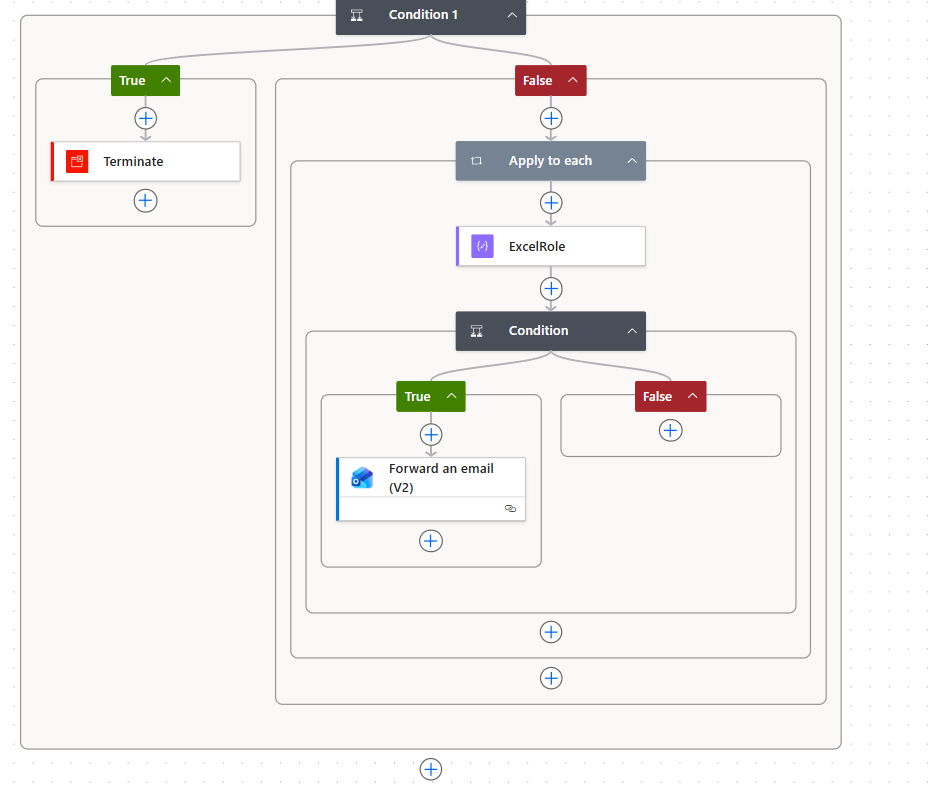

# Smart Email Routing & Approval Flow

## Problem
Manual forwarding of vendor emails was error-prone and time-consuming. Each email subject contains multiple pieces of information separated by a pipe ("|"), and routing to the correct manager depends on knowing the competency and role. Only roles with status "Open" or "Pending Approval" should be forwarded.

## Goal
Automatically route incoming emails to the correct manager based on competency and role, ensuring no emails are lost or misrouted, and only eligible roles are processed.

## Solution
Power Automate flow that:
- Triggers on incoming vendor emails
- Extracts the first two pieces of data from the email subject (competency + role)
- Reads rows from an Excel table containing all roles and their statuses
- Filters rows where status is "Open" or "Pending Approval"
- Checks if competency and role match any Excel entry
- For matching entries, forwards the email to the assigned manager
- Terminates flow for non-eligible entries

## Design Decisions
- Used Excel as a dynamic reference table to separate business logic from the flow
- Applied conditional logic to ensure only eligible roles are forwarded
- Applied row-by-row processing to handle multiple matches reliably
- Logging / auditability ensured through structured flow and Excel

## Impact
- Saves significant manual work weekly for the team
- Reduces errors and ensures only valid emails are routed
- Ensures traceability of routing decisions

## Workflow Overview

### Screenshot of the Flow

### Diagram

